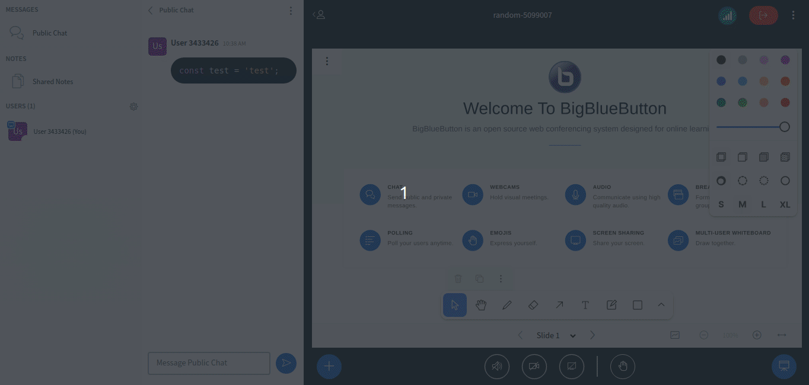

# Code Highlighter Plugin

## What is it?

The Code Highlighter Plugin serves as a chat tool for studenteds and users to demonstrate and compreehend code blocks in simpler, more visual ways.



## Obtaining plugin from CDN

1. Add reference to it on BigBlueButton's `settings.yml`:

```yaml
  plugins:
    - name: CodeHighlighter
      url: https://bigbluebutton.nyc3.digitaloceanspaces.com/plugins/bbb30/CodeHighlighter.js
```

## Running the Plugin from Source

1. Start the development server:

```bash
npm install
npm start
```

2. Add reference to it on BigBlueButton's `settings.yml`:

```yaml
  plugins:
    - name: CodeHighlighter
      url: http://127.0.0.1:4701/static/CodeHighlighter.js
```