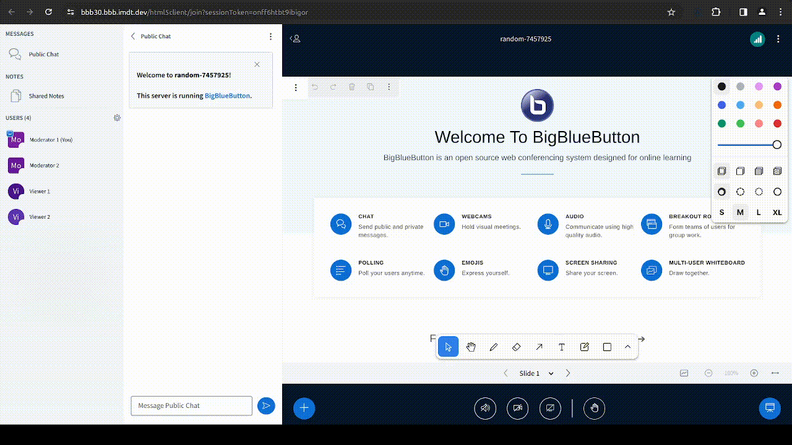

# Pick random user

## What is it?

The Pick Random User Plugin shows a modal for moderator to pick a user (mainly viewer but it could also be a moderator) randomly out of the whole list of users present in a meetings. 



## Running the Plugin from Source

1. Start the development server:

```bash
cd $HOME/src/plugins/pick-random-user-plugin
npm install
npm start
```

2. Add reference to it on BigBlueButton's `settings.yml`:

```yaml
  plugins:
    - name: PickRandomUserPlugin
      url: http://127.0.0.1:4701/static/PickRandomUserPlugin.js
      dataChannels:
        - name: pickRandomUser
          writePermission: ['presenter']
          deletePermission: ['moderator', 'sender']
        - name: modalInformationFromPresenter
          writePermission: ['presenter']
          deletePermission: ['moderator', 'sender']
```

## Building the Plugin

To build the plugin for production use, follow these steps:

```bash
cd $HOME/src/plugins/pick-random-user-plugin
npm ci
npm run build-bundle
```

The above command will generate the `dist` folder, containing the bundled JavaScript file named `PickRandomUserPlugin.js`. This file can be hosted on any HTTPS server.

To use the plugin with BigBlueButton, add the plugin's URL to `settings.yml` as shown below:

```yaml
public:
  app:
    ... // All app configurations
  plugins:
    - name: PickRandomUserPlugin
      url: <<PLUGIN_URL>>
        dataChannels:
        - name: pickRandomUser
          writePermission: ['presenter']
          deletePermission: ['moderator', 'sender']
        - name: modalInformationFromPresenter
          writePermission: ['presenter']
          deletePermission: ['moderator', 'sender']
  ... // All other configurations
```

Alternatively, you can host the bundled file on the BigBlueButton server by copying `dist/PickRandomUserPlugin.js` to the folder `/var/www/bigbluebutton-default/assets/plugins`. In this case, the `<<PLUGIN_URL>>` will be `https://<your-host>/plugins/PickRandomUserPlugin.js`.
