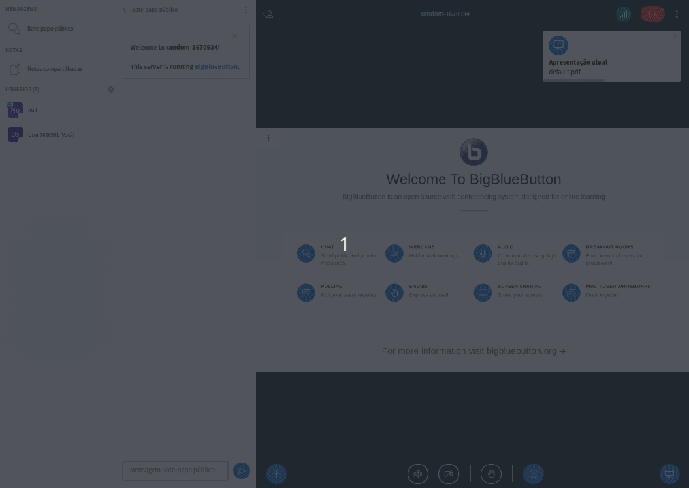

# Sample Action bar items Plugin

## What is it?

This plugin allows the user to share the current session in two ways:

1. Share current session
2. Invite other users



## Obtaining plugin from CDN

1. Add reference to it on BigBlueButton's `settings.yml`:

```yaml
  plugins:
    - name: SessionSharePlugin
      url: https://bigbluebutton.nyc3.digitaloceanspaces.com/plugins/bbb-summit-19/SessionSharePlugin.js
```


## Running the Plugin from Source

1. Start the development server:

```bash
npm install
npm start
```

2. Add reference to it on BigBlueButton's `settings.yml`:

```yaml
  plugins:
    - name: SessionSharePlugin
      url: http://127.0.0.1:4701/static/SessionSharePlugin.js
```
